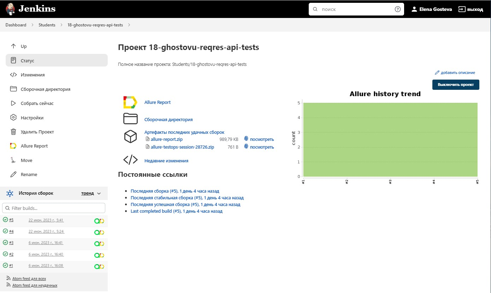
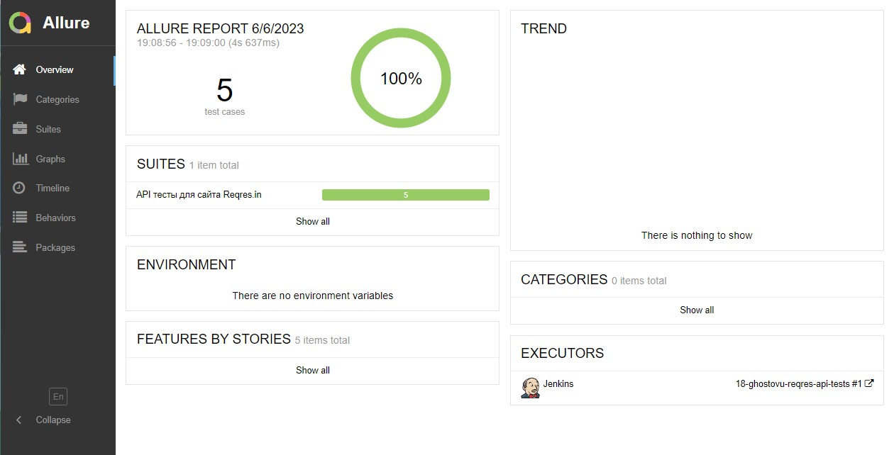
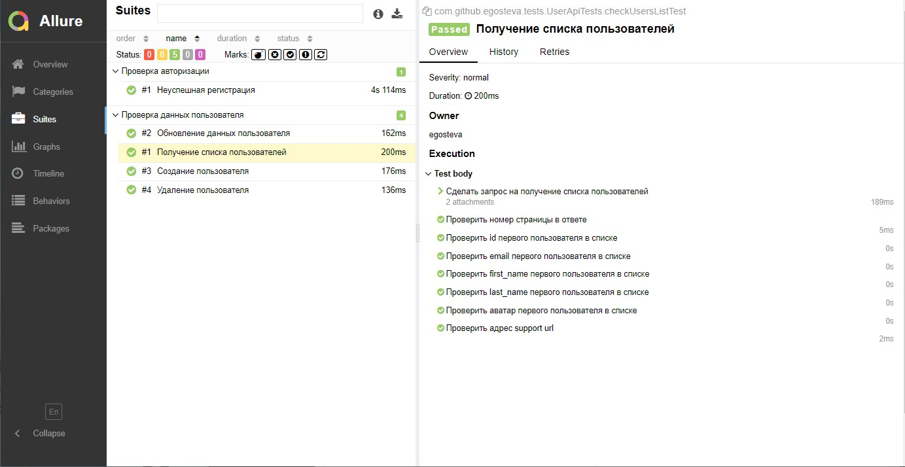
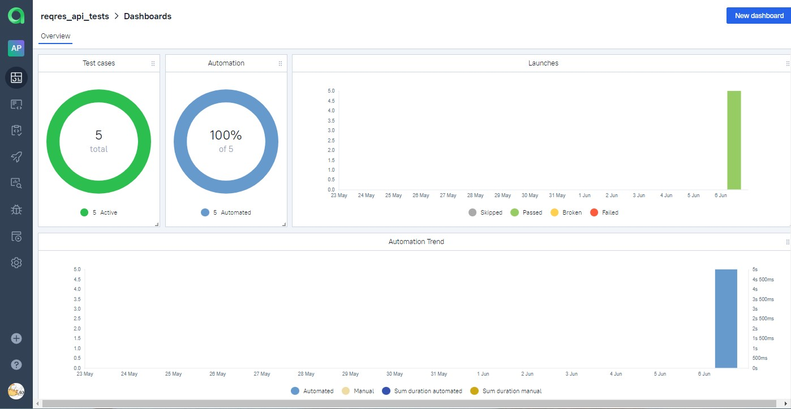
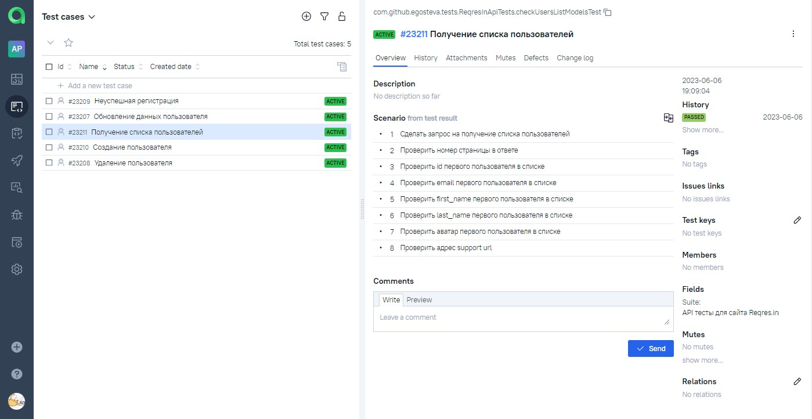
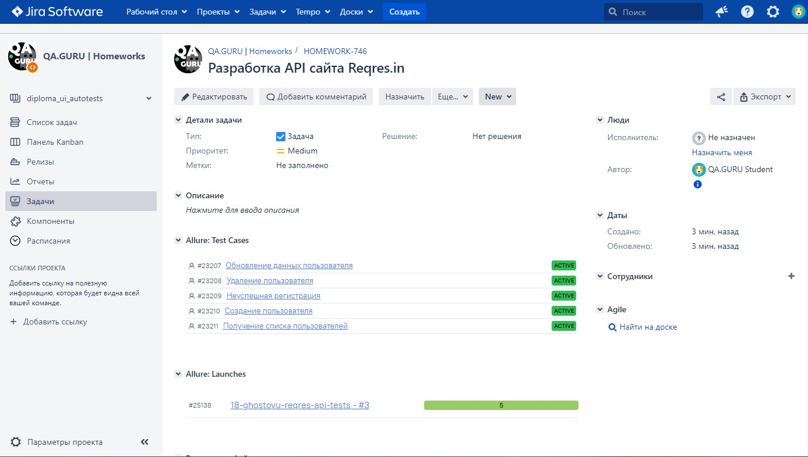
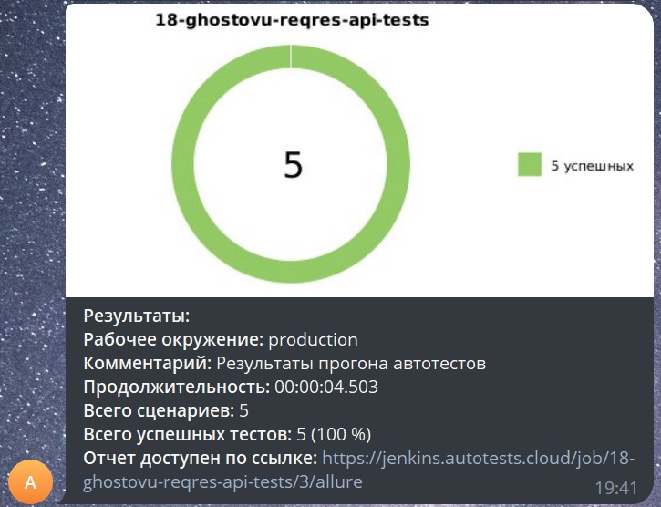

<h1 >Проект автоматизации тестирования API для сайта <a href="https://reqres.in/ ">reqres.in</a></h1>


## :bookmark_tabs: Содержание

* <a href="#tools">Технологии и инструменты</a>

* <a href="#cases">Реализованные проверки</a>

* <a href="#console">Запуск тестов из терминала</a>

* <a href="#jenkins">Запуск тестов в Jenkins</a>

* <a href="#allure">Отчеты в Allure Report</a>

* <a href="#allure-testops">Интеграция с Allure TestOps</a>

* <a href="#jira">Интеграция с Jira</a>

* <a href="#telegram">Уведомления в Telegram с использованием бота</a>

<a id="tools"></a>
## Технологии и инструменты

| Java                                                                                                    | IntelliJ Idea                                                                                                                | GitHub                                                                                                    | JUnit 5                                                                                                          | Gradle                                                                                                    | REST Assured                                                                                                           |                                                                                                         Jenkins |
|:--------------------------------------------------------------------------------------------------------|------------------------------------------------------------------------------------------------------------------------------|-----------------------------------------------------------------------------------------------------------|------------------------------------------------------------------------------------------------------------------|-----------------------------------------------------------------------------------------------------------|-----------------------------------------------------------------------------------------------------------------|----------------------------------------------------------------------------------------------------------------:|
| <a href="https://www.java.com/"></a> | <a id ="tech" href="https://www.jetbrains.com/idea/"></a> | <a href="https://github.com/"></a> | <a href="https://junit.org/junit5/"></a> | <a href="https://gradle.org/"></a> | <a href="https://rest-assured.io/"></a> | <a href="https://www.jenkins.io/"></a> |


| Jira                                                                                                                         | Allure                                                                                                                    | Allure TestOps                                                                                                      |
|:-----------------------------------------------------------------------------------------------------------------------------|---------------------------------------------------------------------------------------------------------------------------|---------------------------------------------------------------------------------------------------------------------|
| <a href="https://www.atlassian.com/ru/software/jira"></a> | <a href="https://github.com/allure-framework"></a> | <a href="https://qameta.io/"></a> |

<a id="cases"></a>
## :ballot_box_with_check: Реализованные проверки

-  Получение списка пользователей
-  Создание пользователя
-  Обновление данных пользователя
-  Неуспешная регистрация
-  Удаление пользователя

<a id="console"></a>
## :computer: Запуск тестов из терминала

```bash
gradle clean test
```

<a id="jenkins"></a>
## </a> Запуск тестов в Jenkins

<a target="_blank" href="https://jenkins.autotests.cloud/job/18-ghostovu-reqres-api-tests ">Сборка в Jenkins</a>
<p align="center">

<a href="https://jenkins.autotests.cloud/job/18-ghostovu-reqres-api-tests/"></a>

<a id="allure"></a>
## </a> Отчеты в [Allure Report](https://jenkins.autotests.cloud/job/18-ghostovu-reqres-api-tests/1/allure/)

### Главная страница

<p align="center">

</p>

### Тест-кейсы

В отчетах отображена информация по запросам и ответам.

<p align="center">

</p>

<a id="allure-testops"></a>
## </a> Интеграция с [Allure TestOps](https://allure.autotests.cloud/project/3350/dashboards)


### Главная страница

<p align="center">

</p>


### Тест-кейсы

<p align="center">

</p>


<a id="jira"></a>
## </a> Интеграция с [Jira](https://jira.autotests.cloud/browse/HOMEWORK-746)

### Интеграция Jira и Allure TestOps
<p align="center">

</p>


<a id="telegram"></a>
## </a> Уведомления в Telegram с использованием бота

<p >

</p>
